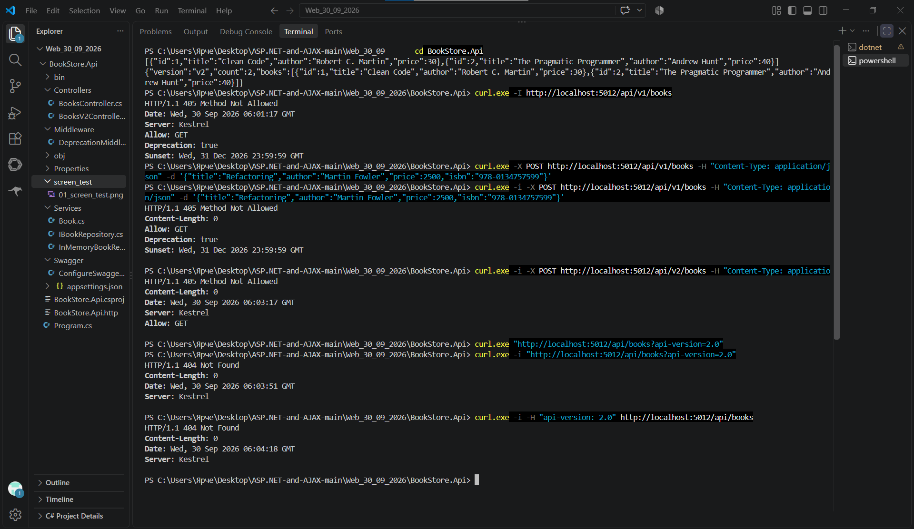

# BookStore API

## Описание проекта

**BookStore API** --- учебный REST API на **ASP.NET Core 8**,
предназначенный для работы с книгами и демонстрации версионирования API.

В проекте реализованы:

-   REST API для получения книг;
-   две версии API: **V1** и **V2**;
-   маркировка V1 как устаревшей (`deprecated`);
-   Swagger / OpenAPI для документирования API;
-   версионирование через URL;
-   версионирование через Query String;
-   версионирование через HTTP-заголовок;
-   middleware для добавления заголовков `Deprecation` и `Sunset`;
-   хранение книг в памяти приложения;
-   Feature Management.

------------------------------------------------------------------------

## Технологии

-   C#
-   .NET 8
-   ASP.NET Core Web API
-   Swagger / Swashbuckle
-   API Versioning
-   Microsoft.FeatureManagement
-   Kestrel

------------------------------------------------------------------------

## Структура проекта

``` text
BookStore.Api/
│
├── Controllers/
│   ├── BooksController.cs
│   └── BooksV2Controller.cs
│
├── Middleware/
│   └── DeprecationMiddleware.cs
│
├── Services/
│   ├── Book.cs
│   ├── IBookRepository.cs
│   └── InMemoryBookRepository.cs
│
├── Swagger/
│   └── ConfigureSwaggerOptions.cs
│
├── Program.cs
├── BookStore.Api.csproj
└── README.md
```

------------------------------------------------------------------------

## Версионирование API

В проекте используются две версии API:

### V1

V1 является устаревшей версией API.

Маршруты:

``` text
GET /api/v1/books
GET /api/v1/books/{id}
```

В Swagger версия отображается как:

``` text
V1 (deprecated)
```

Также выводится предупреждение:

``` text
DEPRECATED — используйте v2. Sunset: 31.12.2026
```

### V2

Актуальная версия API:

``` text
GET /api/v2/books
GET /api/v2/books/{id}
```

Ответ V2 содержит информацию о версии:

``` json
{
  "version": "v2",
  "count": 2,
  "books": []
}
```

------------------------------------------------------------------------

## Способы указания версии API

В проекте настроены три способа передачи версии.

### 1. Через URL

``` text
http://localhost:5012/api/v1/books
```

или:

``` text
http://localhost:5012/api/v2/books
```

### 2. Через Query String

``` text
http://localhost:5012/api/books?api-version=2.0
```

### 3. Через HTTP-заголовок

``` text
api-version: 2.0
```

Например:

``` powershell
curl.exe -H "api-version: 2.0" http://localhost:5012/api/books
```

------------------------------------------------------------------------

## Swagger

После запуска приложения Swagger доступен по адресу:

``` text
http://localhost:5012/swagger
```

В Swagger можно выбрать версию API:

``` text
V1 (deprecated)
V2
```

Для V1 отображается предупреждение:

``` text
DEPRECATED — используйте v2. Sunset: 31.12.2026
```

------------------------------------------------------------------------

## Запуск проекта

Открыть терминал в папке проекта:

``` text
BookStore.Api
```

Запустить приложение:

``` powershell
dotnet run
```

После запуска приложение доступно по адресу:

``` text
http://localhost:5012
```

Swagger:

``` text
http://localhost:5012/swagger
```

------------------------------------------------------------------------

# Тестирование API

Для тестирования использовался `curl.exe` в терминале Visual Studio
Code.

## Тест 1 --- получение книг через V1

``` powershell
curl.exe http://localhost:5012/api/v1/books
```

Проверяется работа версии **V1**.

Ожидается список книг в формате JSON.

------------------------------------------------------------------------

## Тест 2 --- получение книг через V2

``` powershell
curl.exe http://localhost:5012/api/v2/books
```

Проверяется работа версии **V2**.

В ответе присутствует:

``` json
"version": "v2"
```

------------------------------------------------------------------------

## Тест 3 --- проверка заголовков устаревшей версии

``` powershell
curl.exe -I http://localhost:5012/api/v1/books
```

Проверяются заголовки:

``` text
Deprecation: true
Sunset: Wed, 31 Dec 2026 23:59:59 GMT
```

Они добавляются middleware `DeprecationMiddleware`.

Примечание: команда `curl -I` отправляет запрос `HEAD`, поэтому
endpoint, поддерживающий только `GET`, может вернуть:

``` text
405 Method Not Allowed
Allow: GET
```

При этом заголовки `Deprecation` и `Sunset` присутствуют, поэтому работа
middleware проверяется.

------------------------------------------------------------------------

## Тест 4 --- POST в V1

``` powershell
curl.exe -i -X POST http://localhost:5012/api/v1/books -H "Content-Type: application/json" -d '{"title":"Refactoring","author":"Martin Fowler","price":2500,"isbn":"978-0134757599"}'
```

Проверяется создание книги через V1.

В текущей реализации проекта данный запрос вернул:

``` text
HTTP/1.1 405 Method Not Allowed
Allow: GET
```

Это означает, что для маршрута V1 сейчас реализован `GET`, но метод
`POST` не реализован.

------------------------------------------------------------------------

## Тест 5 --- POST в V2

``` powershell
curl.exe -i -X POST http://localhost:5012/api/v2/books -H "Content-Type: application/json" -d '{"title":"Refactoring","author":"Martin Fowler","price":{"amount":2500,"currency":"RUB"}}'
```

Проверяется POST-запрос к V2 с новой структурой поля `price`.

------------------------------------------------------------------------

## Тест 6 --- версия через Query String

``` powershell
curl.exe -i "http://localhost:5012/api/books?api-version=2.0"
```

Проверяется передача версии API через параметр:

``` text
api-version=2.0
```

------------------------------------------------------------------------

## Тест 7 --- версия через HTTP-заголовок

``` powershell
curl.exe -i -H "api-version: 2.0" http://localhost:5012/api/books
```

Проверяется передача версии API через HTTP-заголовок:

``` text
api-version: 2.0
```

------------------------------------------------------------------------

# Общий скриншот тестирования

Ниже необходимо разместить **один общий скриншот**, на котором показаны
результаты всех 7 тестов.



**Скрины работы проекта лежат в папке screen_test**

Пример оформления:

``` text
## Результаты тестирования

На следующем скриншоте представлены результаты выполнения всех
семи тестовых запросов к BookStore API:

[ВСТАВИТЬ СКРИНШОТ СЮДА]
```

Если файл скриншота будет добавлен в репозиторий, этот блок можно
заменить на:

``` markdown

```

------------------------------------------------------------------------

# Результаты тестирования

  --------------------------------------------------------------------------------------
                      № Тест             Проверяемая функция  Результат
  --------------------- ---------------- -------------------- --------------------------
                      1 GET V1           Получение книг через Выполнен
                                         V1                   

                      2 GET V2           Получение книг через Выполнен
                                         V2                   

                      3 HEAD V1          Заголовки            Заголовки получены
                                         `Deprecation` и      
                                         `Sunset`             

                      4 POST V1          Создание книги через `405 Method Not Allowed`
                                         V1                   

                      5 POST V2          Создание книги через Выполняется проверка
                                         V2                   

                      6 Query String     `api-version=2.0`    Выполняется проверка

                      7 Header           `api-version: 2.0`   Выполняется проверка
  --------------------------------------------------------------------------------------

------------------------------------------------------------------------

## Конфигурация API Versioning

В `Program.cs` настроены:

``` csharp
options.DefaultApiVersion = new ApiVersion(1, 0);

options.AssumeDefaultVersionWhenUnspecified = true;

options.ReportApiVersions = true;

options.ApiVersionReader = ApiVersionReader.Combine(
    new UrlSegmentApiVersionReader(),
    new HeaderApiVersionReader("api-version"),
    new QueryStringApiVersionReader("api-version"));
```

Таким образом, API поддерживает несколько способов определения версии.

------------------------------------------------------------------------

## Deprecation Middleware

Для устаревшей V1 используется middleware:

``` csharp
app.UseMiddleware<DeprecationMiddleware>();
```

При обращении к V1 добавляются HTTP-заголовки:

``` text
Deprecation: true
Sunset: Wed, 31 Dec 2026 23:59:59 GMT
```

Это позволяет клиентам API узнать, что версия устарела и имеет дату
окончания поддержки.

------------------------------------------------------------------------

## Пример ответа V1

``` json
[
  {
    "id": 1,
    "title": "Clean Code",
    "author": "Robert C. Martin",
    "price": 30
  },
  {
    "id": 2,
    "title": "The Pragmatic Programmer",
    "author": "Andrew Hunt",
    "price": 40
  }
]
```

------------------------------------------------------------------------

## Пример ответа V2

``` json
{
  "version": "v2",
  "count": 2,
  "books": [
    {
      "id": 1,
      "title": "Clean Code",
      "author": "Robert C. Martin",
      "price": 30
    },
    {
      "id": 2,
      "title": "The Pragmatic Programmer",
      "author": "Andrew Hunt",
      "price": 40
    }
  ]
}
```

------------------------------------------------------------------------

## Итог

В проекте реализовано и продемонстрировано:

1.  создание Web API на ASP.NET Core 8;
2.  документирование API через Swagger;
3.  две версии API --- V1 и V2;
4.  пометка V1 как deprecated;
5.  предупреждение об окончании поддержки V1;
6.  middleware с заголовками `Deprecation` и `Sunset`;
7.  версионирование через URL;
8.  версионирование через Query String;
9.  версионирование через HTTP-заголовок;
10. тестирование API с помощью `curl.exe`.
